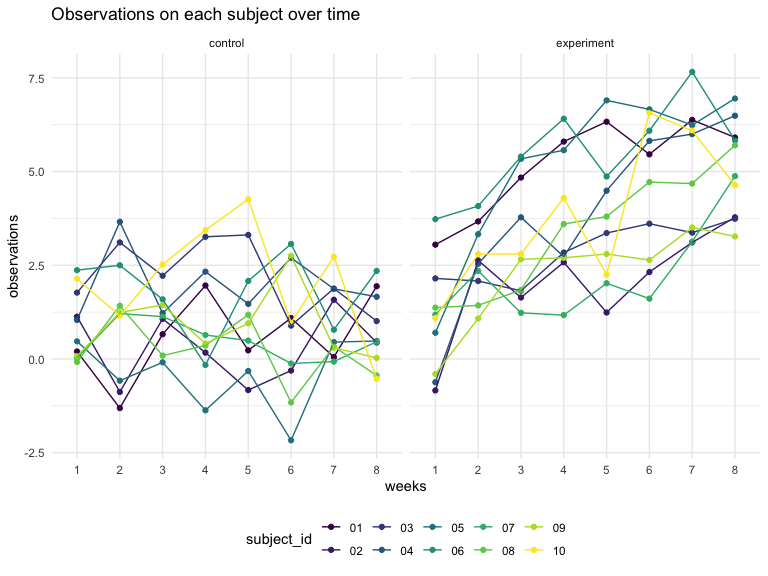

p8105_hw5_yz4720
================
Jasmine Zhang
2023-11-15

# Problem 1

### Homicide dataset

``` r
homicide_df = 
  read_csv("data/homicide-data.csv", na = c("", "NA", "Unknown"))|> 
  mutate(
    city_state = str_c(city, state, sep = ", "),
    resolution = case_when(
      disposition == "Closed without arrest" ~ "unsolved",
      disposition == "Open/No arrest"        ~ "unsolved",
      disposition == "Closed by arrest"      ~ "solved"))|>  
  filter(city_state != "Tulsa, AL") 
```

    ## Rows: 52179 Columns: 12
    ## ── Column specification ────────────────────────────────────────────────────────
    ## Delimiter: ","
    ## chr (8): uid, victim_last, victim_first, victim_race, victim_sex, city, stat...
    ## dbl (4): reported_date, victim_age, lat, lon
    ## 
    ## ℹ Use `spec()` to retrieve the full column specification for this data.
    ## ℹ Specify the column types or set `show_col_types = FALSE` to quiet this message.

The tidy dataset has 52178 observations. Variables include the victim
name, race, age, and sex; the date the homicide was reported; and the
location of the homicide. `city_state` variable is created that includes
both city and state, and a `resolution` variable is created to indicate
whether the case was closed by arrest. The one entry in Tulsa, AL is
excluded because it is not a major US city and is most likely a data
entry error.

### Homicide status by city

``` r
city_homicide_df = 
  homicide_df %>% 
  select(city_state, disposition, resolution) %>% 
  group_by(city_state) %>% 
  summarize(
    hom_total = n(),
    hom_unsolved = sum(resolution == "unsolved"))
```

### Baltimore: unsolved homicide estimation

``` r
bmore_test = 
  prop.test(
    x = filter(city_homicide_df, city_state == "Baltimore, MD") %>% pull(hom_unsolved),
    n = filter(city_homicide_df, city_state == "Baltimore, MD") %>% pull(hom_total)) 

broom::tidy(bmore_test) 
```

    ## # A tibble: 1 × 8
    ##   estimate statistic  p.value parameter conf.low conf.high method    alternative
    ##      <dbl>     <dbl>    <dbl>     <int>    <dbl>     <dbl> <chr>     <chr>      
    ## 1    0.646      239. 6.46e-54         1    0.628     0.663 1-sample… two.sided

### All cities: unsolved homicide estimation

``` r
test_results = 
  city_homicide_df %>% 
  mutate(
    prop_tests = map2(hom_unsolved, hom_total, \(x, y) prop.test(x = x, n = y)),
    tidy_tests = map(prop_tests, broom::tidy)) %>% 
  select(-prop_tests) %>% 
  unnest(tidy_tests) %>% 
  select(city_state, estimate, conf.low, conf.high) %>% 
  mutate(city_state = fct_reorder(city_state, estimate))
```

``` r
test_results %>% 
  mutate(city_state = fct_reorder(city_state, estimate)) %>% 
  ggplot(aes(x = city_state, y = estimate)) + 
  geom_point() + 
  geom_errorbar(aes(ymin = conf.low, ymax = conf.high)) + 
  theme(axis.text.x = element_text(angle = 90, hjust = 1))
```


Chicago has the highest proportion of unsolved homicides among all the
cities.

# Problem 2

### Import study data

``` r
files_df = tibble(
    filename = list.files("./data/problem2/"),
    path = str_c("./data/problem2/", filename)) |>
  mutate(data = map(path, read_csv)) |>
  unnest()
files_df
```

    ## # A tibble: 20 × 10
    ##    filename   path       week_1 week_2 week_3 week_4 week_5 week_6 week_7 week_8
    ##    <chr>      <chr>       <dbl>  <dbl>  <dbl>  <dbl>  <dbl>  <dbl>  <dbl>  <dbl>
    ##  1 con_01.csv ./data/pr…   0.2   -1.31   0.66   1.96   0.23   1.09   0.05   1.94
    ##  2 con_02.csv ./data/pr…   1.13  -0.88   1.07   0.17  -0.83  -0.31   1.58   0.44
    ##  3 con_03.csv ./data/pr…   1.77   3.11   2.22   3.26   3.31   0.89   1.88   1.01
    ##  4 con_04.csv ./data/pr…   1.04   3.66   1.22   2.33   1.47   2.7    1.87   1.66
    ##  5 con_05.csv ./data/pr…   0.47  -0.58  -0.09  -1.37  -0.32  -2.17   0.45   0.48
    ##  6 con_06.csv ./data/pr…   2.37   2.5    1.59  -0.16   2.08   3.07   0.78   2.35
    ##  7 con_07.csv ./data/pr…   0.03   1.21   1.13   0.64   0.49  -0.12  -0.07   0.46
    ##  8 con_08.csv ./data/pr…  -0.08   1.42   0.09   0.36   1.18  -1.16   0.33  -0.44
    ##  9 con_09.csv ./data/pr…   0.08   1.24   1.44   0.41   0.95   2.75   0.3    0.03
    ## 10 con_10.csv ./data/pr…   2.14   1.15   2.52   3.44   4.26   0.97   2.73  -0.53
    ## 11 exp_01.csv ./data/pr…   3.05   3.67   4.84   5.8    6.33   5.46   6.38   5.91
    ## 12 exp_02.csv ./data/pr…  -0.84   2.63   1.64   2.58   1.24   2.32   3.11   3.78
    ## 13 exp_03.csv ./data/pr…   2.15   2.08   1.82   2.84   3.36   3.61   3.37   3.74
    ## 14 exp_04.csv ./data/pr…  -0.62   2.54   3.78   2.73   4.49   5.82   6      6.49
    ## 15 exp_05.csv ./data/pr…   0.7    3.33   5.34   5.57   6.9    6.66   6.24   6.95
    ## 16 exp_06.csv ./data/pr…   3.73   4.08   5.4    6.41   4.87   6.09   7.66   5.83
    ## 17 exp_07.csv ./data/pr…   1.18   2.35   1.23   1.17   2.02   1.61   3.13   4.88
    ## 18 exp_08.csv ./data/pr…   1.37   1.43   1.84   3.6    3.8    4.72   4.68   5.7 
    ## 19 exp_09.csv ./data/pr…  -0.4    1.08   2.66   2.7    2.8    2.64   3.51   3.27
    ## 20 exp_10.csv ./data/pr…   1.09   2.8    2.8    4.3    2.25   6.57   6.09   4.64

### Tidy study data

``` r
files_tidy_df = files_df|>
  janitor::clean_names() |>
  separate(filename, into = c("group", "subject_id"), sep = "_") |>
  mutate(
    group = case_match(group, 
                     "con" ~ "control", 
                     "exp" ~ "experiment"),
    subject_id = str_replace(subject_id, ".csv", ""))|>
  pivot_longer(week_1:week_8, 
               names_to = "week",
               names_prefix = "week_",
               values_to = "observation") |>
  select(group, subject_id, week, observation)
files_tidy_df
```

    ## # A tibble: 160 × 4
    ##    group   subject_id week  observation
    ##    <chr>   <chr>      <chr>       <dbl>
    ##  1 control 01         1            0.2 
    ##  2 control 01         2           -1.31
    ##  3 control 01         3            0.66
    ##  4 control 01         4            1.96
    ##  5 control 01         5            0.23
    ##  6 control 01         6            1.09
    ##  7 control 01         7            0.05
    ##  8 control 01         8            1.94
    ##  9 control 02         1            1.13
    ## 10 control 02         2           -0.88
    ## # ℹ 150 more rows

### Plot: observation over time

``` r
files_tidy_df|>
  ggplot(aes(x = week, y = observation, group = subject_id, color = subject_id)) +
  geom_point()+
  geom_line() +
  facet_grid(.~group) +
  labs(x = "weeks", y = "observations",
       title = "Observations on each subject over time") 
```



In the control group, observations remain relatively stable over the
8-week time period. In the experiment group, observations increase over
time for all 10 subjects over the 8-week time period. The value of
observation is higher at 8-week for experiment group compared to control
group.
